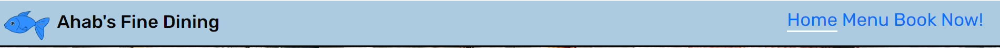
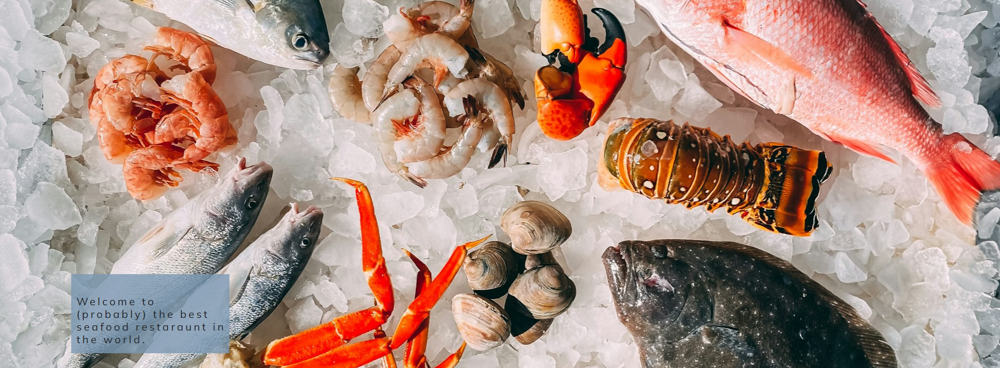

# Ahab's Fine Dining - A portfolio project.

This is my Milestone 1 project. For this, I have decided to create a seafood restaraunt with a focus on appealing to families. In order to reach this aim I decided to keep the website simple and concise so that information can be accessed quickly. As mobile use has increased in recent years, I utilized a mobile first approach with fully responsive websites a design priority.

[Click here to access the live website](https://ccornfield.github.io/Ahab-Dining/)

## Table of Contents

1. [Planning & Development](#planning--development)
2. [Features](#features)
3. [Testing](#testing)
4. [Deployment](#deployment)
5. [Languages](#languages)
6. [Media Queries](#media-queries)
7. [Software](#software)
8. [Code](#code)
9. [Credits](#credits)

# Planning & Development #

### Business Strategy

When I was coming up with the concept of this project I wanted to create something that provided a product that would have a wide reach and appeal to many people. For this I chose a restaraunt with a focus on seafood and craft beer to create something distinct but also familiar enough to reach the demographics I wanted to find.

### Target Audience

While I was not wholly sure of my target audience as I was going into this project due to the knowledge that it would be a mock business, I knew that it would have a focus on families due to my own personal experiences of going to restaraunts with my own parents and brother.

In order to check what demographics would be interested in seafood I decided to use AdTargeting in order to search for "Seafood" and gather marketing data that way. I discovered that "Seafood" was searched by primarily women (66%) within an age range of 35-44. Looking at the "Restaraunts" also showed similar data, with the percentage of woman in the demographic being somewhat lower but still the dominant gender (61%).

### Seafood Keyword Search

* 66% Female demographic
* 35-44 age range

With this in mind the project has benefitted massively from being designed mobile first and with responsive features in mind as while not as tech savvy as younger demographics, people in this age gap are increasingly using smartphones and other devices such as tablets and laptops.

### User Needs

#### User Stories
1. Viewing the menu to decide their order in advance
2. Checking to see what offers are on display
3. Booking their meals in advance to reserve a table.

### Site Objectives

* To make the website concise and easy on the eyes.
* Create a website that was built mobile first with responsive design elements.
* To provide a menu that could be read and understood on any device.
* Allow customers to book food in advance
* Provide links to relevant social media pages
* Make site navigation simple and easy to use.
* Aesthetically appealing.
* A good flow of UI design elements to guide users from page to page.
* To ensure accessibility for screen readers.

### Research

While designing and planning this website I looked at other portfolios as well as restaraunt websites on the internet in order to develop and idea of what I needed to achieve the sites goals.

These sites were:

[Kate Brush Portfolio](https://github.com/kateuj/kate-brush-portfolio)
[Coedseren Healing](https://github.com/ahaffg/coedseren)
[Blue Mountain Development](https://github.com/Ant2210/project1)
[TGI Fridays](https://www.tgifridays.co.uk/)

I took notice of their design and incorporated elements of them into my own work.

### Wireframe

While deciding on how to make my website, I opted to use balsamiq to create wireframes of how the website would look like on desktops. The designs were not final but most of the design elements survived til the finished product. Balsamiq was somewhat unintiutive first but after reading documentation it proved to be a very effective tool. I started with desktop since I was going to be using bootstrap for the project and I knew that utilizing it's feature would allow me to go back and adjust elements until they worked on both deskrop and mobile.

### Color Scheme

While demographics weren't an overwhelming concern at this time, considering I was mainly assuming a target audience of families, I based the color scheme of the website off of 3 dominant colors; White, Black and Blue. I changed up the shades of blue depending on their spot in the website in an effort to break up the colors to create a more appealing aesthetic. These cool blues also appeal to the chosen demographic as the tones provided make site navigation easy on the eyes.

### Typography

For the typeface used for my project, the majority of the text used the mullish font. I chose this font because of it's clean shapes, making the text easier to read even on a smaller screen such as a phone. For the font used in the logo and the header buttons I decided to use rubik font. Originally I wanted to use the rubik puzzle font due to it appearing more akin to something one would see in a marine environment i.e. a pirate ship. It had to be scrapped however due to it being to aggressive on the eyes on smaller screens, making the buttons clunky to read and hampering site readability.

# Features #

### General

I have successfully managed to make the website responsive, able to be viewed on both mobile and desktop devices without sacrificing aesthetic quality or site readability.

### Favicon

The following favicon was created by first utilizing an image I found on freepik.com and putting through a web service called favicon.io that then converted the image into a favicon that worked on desktop, mobile, android and apple devices. At first I was considering reusing the site logo before deciding a unique favicon might appear as more professional to potential customers.

## Home Page

### Header

The header for my website went through multiple changes, such as the font that would be used, the color of the text and how it should be padded and margined as best give it the screen size needed to stand out. For this aspect of the project, I used the lightest blue in my color scheme, since I new that it would pop out when placed above an intended hero image. Originally it was going to be fixed to where the user was on the page however this was changed due to both the pages of the site being short in length thus removing the need for a peristent header and also due to issues with the header covering large portions of the hero image that would make it appear amateur.

### Hero Image

When I was researching how to design my website by looking at the works of colleagues and other restaraunts, 4/5 of them had utilized some kind of hero image in order to grab the readers attention before anything else. Such a hero image could easily inform the reader exactly what kind of site it is before they continue. While developing the hero image, I made sure that at all screen sizes it could be easily read and understood by remaining centralized in it's container.

### Offers

One of the main goals of the site that I wanted to successfully achieve was by using it to update customers on the offers that are currently taking place at the store. One solution could have been a revolving gallery that slowly scrolled through them but this would have taken too much time to implement for such a simple project. My solution was to use the bootstrap column system to give each image it's own column at 4-4-4 and to then merge them together once the screen size was small enough so that they could follow one after another for a seamless reading experience.

### Contact Details

Another of the core goals that I had attempted to achieve with this site was to allow customers how to find out how to both contact and reach the owners of the website. While creating the tables for opening times was simple as was creating the contacts for email and phone, trying to implement google maps was tricky. I didn't have the resources to create an api to have google maps appear directly on the page so my workaround for this was to create a button that hyperlinked to a google maps search result for a nearby seafood restaraunt. I wanted these details to be cleanly presented so that customers would be able to find the restaraunt before engaging further e.g. browsing the menu and booking a table.

### Footer

This footer was inspired by the portfolios of other code institute learners. After making the wireframe and testing I decided that I didn't like having the footer the exact same as the header, and so I opted for a design that consisted entirely of the relevant social media links laid out in a line in the footer. All the links open out onto a new tab as to improve user experience. Making them change color on hover was a decision made to help make sure users knew what site they would be going onto when they clicked the button.

## Menu Page

### Title and Image

While admittedly not something I saw on my research examples, I felt like by just having an accordion in the space, the page would feel empty and invite a feeling of hostility. To rectify this, I added a small welcoming blurb to the page along with another hero image that wasn't as elaborate as the home page to make the space feel more lived in. All image credits can be found in the credit section of this readme.

### Accordion

An accordion was chosen in order to be efficient with screen space. Earlier versions of the site attempted to use a folder system to make it open up to left and right while pressing one button would close all others. This didn't work in practice so the accordion was used instead since it would also be easier to make responsive as you would only need to adjust it's width to fit the screen. Inside the accordion the menu was structed by using a title which was the name of the menu item, an image of the item sourced online, the blurb for it and a page break to seperate blurbs from titles. On smaller screens there would often be an issue of image overspill where the images used would break out of the accordion and spill onto the rest of the page. This was fixed by making the images in the accordion invivisble on devices below 400px in width.

## Form Page

### Form

The form was designed to achieve the most important goal of the site; To allow customers to book online after being enticed by the rest of the user experience they'd had thus far. The form was kept to asking only the most important questions that a restaraunt would want to know. First the full name and email is gathered as means to get back in touch with the customer. Then how many patrons are asked for so that the user can input as many people as allowed due to the implication that this is a small local restaraunt. Then the date and time are asked for. There is currently a bug where the user can input dates that have happened in the past however this can be fixed in a future update by using javascript.
Finally, the user is asked if the occassion is a birthday or not before they are asked to read the terms and conditions then accept them and submit the form which takes them to a code institute formdump where the inputs are readback to them. Future versions of the site will go to an actual server where these details can be stored and called upon as needed.

## 404

This is the custom 404 page used when a site element does not work as intended. The user will be redirected here where it will clearly explain what the error is, what has happened, and then provide a clear and easy way to return to the home screen. This was important to me since I felt that if the user was sent to the default 404 page they would be put off by the site and not want to come back. A custom 404 would soften this blow and make them more likely to give the site a second chance.

# Testing #

While I was developing the website, I tested the website multiple times by making a change to the website and then opening up the file on my personal pc to make sure that the change worked as intended. Later into the project I started to push my changes more frequently and started to test my changes on the live site which proved to crucial in preventing critical errors in the code. Using Chrome Developer Tools I was able to consistently check if my web pages were apropriately responsive based on the height and width I was testing. I also tested my website on both google chrome and microsoft edge to make sure that it would work on multiple browsers.

### Home Page Testing

I tested the home page by making sure that the hero image was sized correctly, that all the links along the top were clickable along with sending people to the correct page and that the logo was also able to send people to the home screen from anywhere. At first I was using rubik puzzle for my text in the header, but I decided that it was clashing too much with the rest of the website along with being harder to read on smaller devices. Therefore it was replaced with rubik which worked out much better. Making sure that the underlining worked on all sites was important too, so that the user knew what site they were on at all times.

An issue I had with the homepage for a substantial time was were a white bar would persist on the main page even after setting the body of the page to not have any padding or margins unless requested. This was corrected by specifically targetting rows in css and removing their left margins. This then led to a blue bar on the hero image where the image struggled to stretch across. This too was fixed by specifically targetting the right padding of the image and setting it to zero.

An issue at first with the footers was that I forgot to make them open up onto a new page. This meant that click on the links would lead them to the website they clicked onto but on the same tab that they were using to open the website. Making it more cumbersome to explore links while also having to backtrack to the site each time. I was luckily able to notice this and corrected it without issue.

### Menu Page Testing

The bulk of menu testing was in the testing of responsiveness, chiefly the images. Quite often during testing the images would spill out of the accordion even on laptops and smaller desktops. At first the solution was to change the image sizes depening on what screen size was used. This was effective for the small desktops and mobiles but left things to be desired on mobile devices. The solution there ultimately became to just remove the images, this would boost performance and make it so the scroll from top to bottom is shorter, improving user experience.

### Booking Page Testing

Testing the booking page was done by making sure that the fields were labelled correctly, were able to be interacted with and were assigned as required were appropriate. All the elements worked as intended and the submit button linked to the correct page. The page was also responsive as it was able to change to still be readable even on smaller screen sizes.

### 404 Page Testing

The page was responsive and the link that redirected people back to the home page worked as designed.

## Validator Testing

### W3C Validator

When I put my Home Page through the validator I was quickly told my images lacked alt text. It also lacked a lang tag in the html head and had a section without content by telling to add a header to a section. However when I checked the section it was completely empty. There was another error telling me to have a button be the descendant of a hyperlink but since I wanted this button to redirect from the site I was unsure how to fix it without hampering functionality. 

The most common error I recieved on my menu page was the lack of alt text on the images. This was because alt text is used to aid in screenreaders relaying the information to a visually imparied reader. However, I feel like alt images on the pictures inside the accordion are not nessecary due to important details not being lost by their omission as demonstrated by how by viewing them on mobiles devices, they disappear and yet maintain clarity and readability.

When I put my CSS file through the validator I did not recieve any errors.

# Deployment #

In order to deploy my website, I used github pages. In order to use this service I had to do the following:

1. Go into my project repository
2. Click on the settings icon
3. Click on the source drop down and select the option "Deploy from branch"
4. In the branch drop down, select the option "main", this can be found in the root folder.
5. Select the folder dropdown a
6. Press the save button.
7. After reloading you should see that the site is live.
8. Click the visit site button or use the link provided to access the site at any time.

# Languages #

For the development of this website I utilized both HTML and CSS in order to create it. Bootstrap 5.3.3 was used to create the accordion and for it's grid system in laying out site features.

# Media Queries #

Media Queries were used exclusively in the role of increasing the responsiveness of web pages by adjusting their contents based on the maximum width of the screen.

# Software #

VS Code was used to create the website. It was the tool for typing out HTML and CSS code along with pushing site updates to the Github repository. Github and by extension Git was used to edit the website once it had been pushed to the repository while also being used to host the website and make it live.

Balsamiq was used to create the wireframes saw earlier in this readme.

The microsoft snipping tool was used to take the relevant screenshots.

# Code #

I had adapted [This bootstrap code](https://getbootstrap.com/docs/5.3/components/accordion/) to create the accordion that can be seen in the menu page. I had also used code from both the "Love Running" and "Coders Coffeehouse" for the hero image and form designs respectively.

For the favicon I used [a generator](https://favicon.io/) in order to generate the files and code that was used to apply it to my entire site.

# Credits #

Code Institute for the opportunity to learn and hone the craft of developing websites.

My loving and supportive family for supporting me in this endeavor.

### Image Credits

https://unsplash.com/photos/orange-and-white-fish-on-white-and-black-pebbles-tHjXXy1kk_Q?utm_content=creditCopyText&utm_medium=referral&utm_source=unsplash
https://unsplash.com/photos/shallow-focus-photography-of-two-boys-doing-wacky-faces-FtL07GM9Q7Y?utm_content=creditCopyText&utm_medium=referral&utm_source=unsplash
https://unsplash.com/photos/grilled-fish-cooked-vegetables-and-fork-on-plate-bpPTlXWTOvg?utm_content=creditCopyText&utm_medium=referral&utm_source=unsplash
https://unsplash.com/photos/person-filling-clear-glass-with-liquid-8T5UAV6KkZA?utm_content=creditCopyText&utm_medium=referral&utm_source=unsplash
https://unsplash.com/photos/a-neon-sign-in-the-window-of-a-restaurant-6h04tpALqgo?utm_content=creditCopyText&utm_medium=referral&utm_source=unsplash
https://unsplash.com/photos/person-pouring-brown-liquid-on-clear-drinking-glass--Ygu9Qx309s?utm_content=creditCopyText&utm_medium=referral&utm_source=unsplash
https://www.hiclipart.com/free-transparent-background-png-clipart-jaavm
https://www.freepik.com/icon/fish_9164602
https://unsplash.com/photos/soup-in-bowl-fxJTl_gDh28?utm_content=creditCopyText&utm_medium=referral&utm_source=unsplash
https://en.wikipedia.org/wiki/Fishcake
https://realfood.tesco.com/recipes/prawn-cocktail.html
https://www.taste.com.au/recipes/chilli-prawn-tomato-spaghetti/c6ab8078-1b4b-408a-9249-89ea428a2790
https://www.bbcgoodfood.com/recipes/crab-saffron-risotto
https://www.delish.com/cooking/recipe-ideas/a26883467/grilled-lobster-tail-recipe/
https://www.foodandwine.com/fish-and-chips-6415583
https://recipes.net/dessert/fruit-desserts/fruit-kebabs-recipe/
https://www.giallozafferano.com/recipes/Lemon-cheesecake.html
https://www.seriouseats.com/single-malt-scotch-vanilla-bean-ice-cream-recipe
